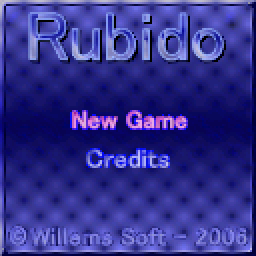
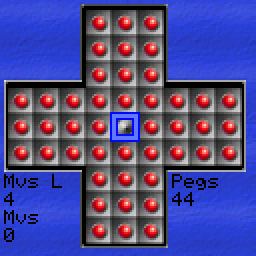

# Rubido Embedded Version
   

Rubido is a little chinese checkers or solitaire game with four difficulties.

## Screenshots
The browser build, at twice the game's own 128x128:

| Title screen | In game |
| --- | --- |
|  |  |

## Playing the Game:
The aim of the game in chinese checkers is to select a (white) peg on the board and jump over another (white) peg to land on an empty (black) spot. When doing this the peg you jumped over will be removed from the board.
You need to play the game in such a way that only one peg remains on the board at the end. Depending on the difficulty you had chosen this can be either (only) in the middle of the board or anywhere on the board.
Also depending on the difficulty you had chosen you can either jump horizontally and veritically over pegs or diagonally as well.

## Diffuclties 

### Very Easy
- Jump over Pegs vertically, horizontally and diagonally
- Last Peg can be anywhere on the board

### Easy
- Jump over Pegs vertically, horizontally and diagonally
- Last Peg must end on the middle board

### Hard
- Jump over Pegs vertically and horizontally only
- Last Peg can be anywhere on the board

### Very Hard
- Jump over Pegs vertically and horizontally only
- Last Peg must end on the middle board

## Controls

| Button | Action |
| ------ | ------ |
| Left | Left in difficulties screen. During gameplay move the peg selector left. |
| Right | Right in difficulties screen. During gameplay move the peg selector Right. |
| Up | Up in main menu screen. During gameplay move the peg selector Up. |
| Down | Down in main menu screen. During gameplay move the peg selector Down. |
| A | Confirm in menu and difficulty selector. During gameplay activate the peg where the peg selector is. If there was a peg already selected it will deselect it |
| B | return to titlescreen |
| (A) + Left + Down | Show or hide the debug info |

### Buttons
The game's buttons on every device:

| Device | D-pad | A | B |
| ------ | ----- | - | - |
| ESPboy | d-pad | ACT | ESC |
| Gamebuino META | d-pad | A | B |
| Adafruit PyBadge | d-pad | A | B |
| Adafruit PyGamer | joystick | A | B |
| Pimoroni PicoSystem | d-pad | A | B |
| Pimoroni Explorer | A up, C down, B left, Y right | X | Z |
| Pimoroni Tufty 2350 | UP up, DOWN down, A left, C right | B | HOME |
| TinyCircuits Thumby Color | d-pad | A | B |
| Playdate | d-pad | A | B |
| Libretro | d-pad | A | B |
| Game Boy Advance | d-pad | A | B |
| Nintendo DS | d-pad | A | B |
| Nintendo 3DS | d-pad or circle pad | A | B |
| Nintendo 64 | d-pad | A | B |
| PlayStation | d-pad | Cross | Circle |
| PlayStation Portable | d-pad or the analog stick | Cross | Circle |
| PlayStation Vita | d-pad or the left stick | Cross | Circle |
| Windows | arrow keys | X | C |
| MS-DOS | arrow keys | X | C |
| Browser | arrow keys | X | C |

On the Tufty 2350 a tap of HOME is B when it is let go.

On the Gamebuino META holding HOME for a second goes back to its loader.

## Devices
Every [release](https://github.com/joyrider3774/rubido_embedded/releases) has a build for every device. `releases/` is where a build of your own puts them, it is not part of the repository:

| Device | File | How to install |
| ------ | ---- | -------------- |
| [ESPboy](https://www.espboy.com/) | ESPboy_Rubido.bin | flash it, the board is a LOLIN(WEMOS) D1 mini |
| [Gamebuino META](https://gamebuino.com/gamebuino-meta) | GamebuinoMeta_Rubido.bin | copy it into a folder on the SD card, the .hex is for flashing it directly |
| [Adafruit PyBadge](https://www.adafruit.com/product/4200) | PyBadge_Rubido.uf2 | double press reset and copy it onto the drive that appears |
| [Adafruit PyGamer](https://www.adafruit.com/product/4242) | PyGamer_Rubido.uf2 | same as the PyBadge |
| [Pimoroni PicoSystem](https://shop.pimoroni.com/products/picosystem) | PicoSystem_Rubido.uf2 | hold X while switching on and copy it onto the drive that appears |
| [Pimoroni Explorer](https://shop.pimoroni.com/products/explorer?variant=42092697845843) | Explorer_Rubido.uf2 | hold BOOT while pressing RESET and copy it onto the drive that appears |
| [Pimoroni Tufty 2350](https://shop.pimoroni.com/products/tufty-2350?variant=55811986227579) | Tufty_Rubido.uf2 | hold HOME while pressing RESET and copy it onto the drive that appears |
| [TinyCircuits Thumby Color](https://tinycircuits.com/products/thumby-color) | ThumbyColor_Rubido.uf2 | put it into bootloader mode and copy it onto the RPI-RP2 drive that appears |
| [Playdate](https://play.date/) | Playdate_Rubido.pdx.zip | unzip it and sideload Rubido.pdx, the same pdx runs in the Playdate simulator |
| [Libretro / RetroArch](https://www.retroarch.com/) | Libretro_Rubido.zip | copy rubido_libretro.dll into RetroArch's cores folder and rubido_libretro.info into its info folder, then Load Core and Start Core |
| [Game Boy Advance](https://en.wikipedia.org/wiki/Game_Boy_Advance) | GBA_Rubido.gba | put it on a flash cart or open it in an emulator, the best pegs left are saved in the cartridge's SRAM |
| [Nintendo DS](https://en.wikipedia.org/wiki/Nintendo_DS) | NDS_Rubido.nds | put it on a flash card or open it in an emulator, the best pegs left are saved next to it in Rubido.sav |
| [Nintendo 3DS](https://en.wikipedia.org/wiki/Nintendo_3DS) | 3DS_Rubido.3dsx | copy it into /3ds/ on the SD card and start it from the Homebrew Launcher, or open it in an emulator, the best pegs left are saved in sdmc:/3ds/Rubido/ |
| [Nintendo 64](https://en.wikipedia.org/wiki/Nintendo_64) | N64_Rubido.z64 | put it on a flash cart or open it in an emulator, the best pegs left are saved in the cartridge EEPROM |
| [PlayStation](https://en.wikipedia.org/wiki/PlayStation_(console)) | PSX_Rubido.exe | open it in an emulator or send it to a console that runs unsigned code, the progress is not saved yet |
| [PlayStation Portable](https://en.wikipedia.org/wiki/PlayStation_Portable) | PSP_Rubido.PBP | rename it to EBOOT.PBP and put it in ms0:/PSP/GAME/Rubido/ on the memory stick, or open it in PPSSPP |
| [PlayStation Vita](https://en.wikipedia.org/wiki/PlayStation_Vita) | Vita_Rubido.vpk | install it with VitaShell on a Vita with homebrew enabled, or open it in Vita3K |
| Windows | Windows_Rubido.exe | runs on its own, the best pegs left are saved next to it in Rubido.sav |
| MS-DOS | DOS_Rubido.zip | unzip RUBIDO.EXE onto a DOS machine or into DOSBox and run it, the best pegs left are saved next to it in RUBIDO.SAV |
| Browser | Web_Rubido.zip | upload it to an itch.io HTML project, or unzip it and open index.html from a web server, the best pegs left are saved in the browser |

The Tufty 2350 has no speaker, the game is silent there. Holding RESET until the rear LEDs are dark puts it to sleep, a front button wakes it up again, with UP and DOWN held as well it goes into shipping mode instead.

The Thumby Color's display is 128x128, the game's own size, so it is shown 1:1 over the whole screen. That build has not been tried on the device itself yet.

The Playdate shows the black & white skin, scaled up in the middle of its display.

The Game Boy Advance shows the game scaled to 160x160 in the middle of its screen, with black bars at the sides.

On the Nintendo DS the game is scaled to 192x192 in the middle of the top screen, with black bars at the sides, and the bottom screen stays dark. What the game saves goes into Rubido.sav on the card it was started from, so a card that libfat can not write to (or an emulator without one) plays the game but forgets it afterwards. Its tones are square waves played as a sample: the DS's own tone channels count their frequency in a 16 bit timer and can not go below about 256 Hz.

On the Nintendo 3DS the game is scaled to 240x240 in the middle of the top screen, with black bars at the sides, and the bottom screen stays dark. What the game saves goes into sdmc:/3ds/Rubido/Rubido.sav. Its tones play through the console's DSP when the DSP firmware has been dumped to the SD card (sdmc:/3ds/dspfirm.cdc), and through CSND when it has not: on hardware either one plays, in an emulator only the DSP one does.

On MS-DOS the game runs in VGA mode X, 320x240 in 256 colours, blown up to 240x240 in the middle of the screen with black bars at the sides. That mode rather than the usual 320x200 one because its pixels are square, where 320x200 is stretched over the same screen and would show the game a fifth too tall. The 256 colours are set to the RGB332 cube, which is exactly what the game's 8 bpp screen buffer holds, so a frame reaches the card without a colour being worked out. Its tones are a square wave on the PC speaker, the best pegs left are saved next to the program in RUBIDO.SAV, and Escape quits. The program is 32 bit and carries the CWSDPMI host inside it, so it needs nothing beside it on the disk.

In a browser the game is drawn into a canvas of its own 128x128 pixels, which the page stretches to whatever room it is given while keeping it square and keeping the pixels sharp. The best pegs left are saved in the browser's localStorage under the game's name, so a private window plays it but forgets it afterwards. The zip holds index.html, index.js and index.wasm and is what an itch.io HTML project takes as it is.

On the Nintendo 64 the game is drawn into memory in the colours the RDP takes and the RDP shows it scaled to 240x240 in the middle of its 320x240 screen, with black bars at the sides. Its tones are a square wave written into the buffers the sound hardware plays from. The best pegs left are saved in the cartridge EEPROM, which the ROM says it has, so a cartridge or an emulator without one plays the game but forgets it afterwards.

On the PlayStation the game is drawn into memory in the colours the GPU takes, handed to it as a texture and shown scaled to 240x240 in the middle of its 320x240 screen, with black bars at the sides. Its tones are a square wave the SPU plays from a single looping block. The memory card is not written yet, so what the game saves is gone when the console is switched off.

On the PlayStation Portable the game is doubled to 256x256 in the middle of the display, and the high scores are saved next to the EBOOT.PBP in Rubido.sav.

On the PlayStation Vita the game is blown up four times to 512x512 in the middle of the display, and the high scores are saved in ux0:data/Rubido/Rubido.sav.

## Building
`python tools/build_releases.py` builds a release for every device  
`python tools/convert_skins.py` turns the images in `assets/skins` into the headers the game includes  
The Playdate build also needs the Playdate SDK, see `platforms/playdate/CMakeLists.txt`  
The libretro core needs libretro-common, see `platforms/libretro/CMakeLists.txt`  
The Game Boy Advance build needs devkitARM and libgba, see `platforms/gba/CMakeLists.txt`  
The Nintendo DS build needs devkitARM, libnds and calico, see `platforms/nds/CMakeLists.txt`  
The Nintendo 3DS build needs devkitARM and libctru, see `platforms/3ds/CMakeLists.txt`  
The PlayStation build needs PSn00bSDK, see `platforms/psx/CMakeLists.txt`  
The Nintendo 64 build needs the mips64-elf toolchain and libdragon, see `platforms/n64/CMakeLists.txt`  
The PSP build needs the pspdev toolchain, see `platforms/psp/CMakeLists.txt` (pspdev has no Windows build, so on Windows it is built from WSL)  
The Vita build needs VitaSDK, see `platforms/vita/CMakeLists.txt`  
The browser build needs Emscripten, see `platforms/web/CMakeLists.txt`  
The MS-DOS build needs DJGPP, see `platforms/dos/CMakeLists.txt`

## Credits
- Graphics are made by me willems davy aka joyrider3774 using gimp
- Thanks to Roman for sending me an [espboy](https://www.espboy.com/)
